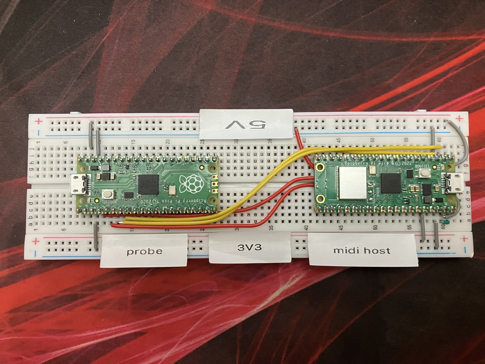
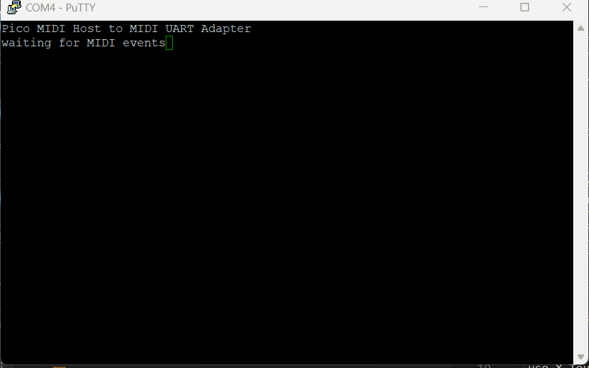

# Proof of Concept - USB MIDI host ("hardware USB" -- not PIO)
This repo contains a proof of concept of hosting a MIDI controller (Behringer X-Touch mini in my case) via the built-in USB controller of the Raspberry Pi Pico.  I happen to be using the Pico W, but that is not required for this test.

Unlike [rppicomidi](https://github.com/rppicomidi) (which this project borrows heavily from), I am using the built-in USB controller to leave the PIO and hardware I2C units free to handle my planned 10 OLED displays.

# Setup
On the breadboard, I have a Pico W (the "midi host") and a standard Pico (the "probe").  The 2 are wired together according to the standard picoprobe setup.  The picoprobe firmware is obtained from the official [Raspberry Pi download](https://www.raspberrypi.com/documentation/microcontrollers/raspberry-pi-pico.html#debugging-using-another-raspberry-pi-pico).  The "pico_midi_host" firmware is built from the sources of this project.

# Building with Docker
To ensure that the build environment is reliable, I am using a patched version of my [pico-build-docker](https://github.com/burtonrodman/pico-build-docker) container image.  See that repo for more information.  I have created an additional Dockerfile/script in the container to patch the SDK version of tinyusb from the fork contributed by [rppicomidi](https://github.com/rppicomidi) [rppicomidi/tinyusb/tree/midihost](https://github.com/rppicomidi/tinyusb/tree/midihost).  To build the patched container image use the following command:

`docker build . -t pico-sdk:midihost`

Update `.vscode/tasks.json` with the new image name/tag

# Testing
- use X-Touch Edit to set your X-Touch to Mackie Control mode
- flash the picoprobe firmware to the probe unit
- build this project (Ctrl+Shft+B) and flash pico_midi_host.uf2 to the midi host unit
- plug in the probe unit to your computer and open a PuTTY session
- plug in the Behringer X-touch Mini using a USB Micro B to USB Mini B cable
- confirm that you see the mount message in PuTTY
- press buttons, knobs and fader to see data received in PuTTY
- unplug and replug the X-Touch to confirm device works after replugging

# Amazon Links
- [CERRXIAN USB OTG Cable - Black, USB Micro Male to Mini Male OTG Cable (Black) (1m)](https://www.amazon.com/dp/B01KG2RZF4?psc=1&ref=ppx_yo2ov_dt_b_product_details)
- [Behringer X-TOUCH MINI Ultra-Compact Universal USB Controller](https://www.amazon.com/Behringer-XTOUCHMINI-BEHRINGER-USB-Controller/dp/B013JLZCLS)